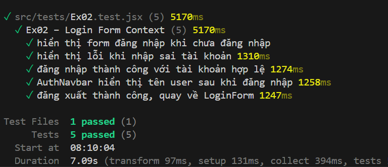

## 📝 Mô tả thay đổi

- **Nội dung thực hiện trong PR này:**
  - Khởi tạo `AuthContext` và `AuthProvider` tại `src/context/AuthContext.jsx` để quản lý trạng thái đăng nhập (`user`, `loading`, `error`), giả lập gọi API đăng nhập trễ 800ms.
  - Xây dựng `LoginForm` tại `src/components/auth/LoginForm.jsx` có xử lý state email, password nội bộ, và sử dụng `login` từ context.
  - Xây dựng `Dashboard` tại `src/components/auth/Dashboard.jsx` hiển thị thông tin tài khoản sau khi đăng nhập thành công.
  - Cập nhật `AuthNavbar` tại `src/components/auth/AuthNavbar.jsx` hiển thị thông tin người dùng và tích hợp hàm `logout`.
  - Cấu hình trang `Ex02LoginPage.jsx` bọc toàn bộ nội dung trong `<AuthProvider>` và điều hướng render hợp lý dựa vào trạng thái người dùng.

- **Lý do tại sao cần thay đổi này?**
  - Quản lý trạng thái xác thực toàn trang (authentication state) tập trung thông qua `AuthContext` để tránh việc truyền tải thông tin user qua các components lồng nhau một cách phức tạp, hoàn thiện luồng đăng nhập giả lập cho ứng dụng.

## 🔗 Liên kết liên quan

- Giải quyết Issue số: #2

## 🧪 Quá trình kiểm thử (Testing)

- [x] Đã chạy unit test và pass: Đã chạy bộ test nội bộ qua lệnh `npm test Ex02` (Kết quả đạt kỳ vọng: **5/5 test cases pass**).
- [x] Đã kiểm tra các nghiệp vụ chính: Kiểm tra đăng nhập với các tài khoản đúng, sai, hiển thị trạng thái loading, kiểm tra render navbar và dashboard, xử lý đăng xuất thành công.

## 📸 Hình ảnh / Ảnh chụp màn hình (nếu có)

## 📋 Checklist trước khi Merge

- [x] Code tuân thủ đúng quy chuẩn của dự án (Tên PR đặt chuẩn: `feat(auth): implement login features (#2)`).
- [x] Đã cập nhật dòng TODO tương ứng trong file `README.md`.
